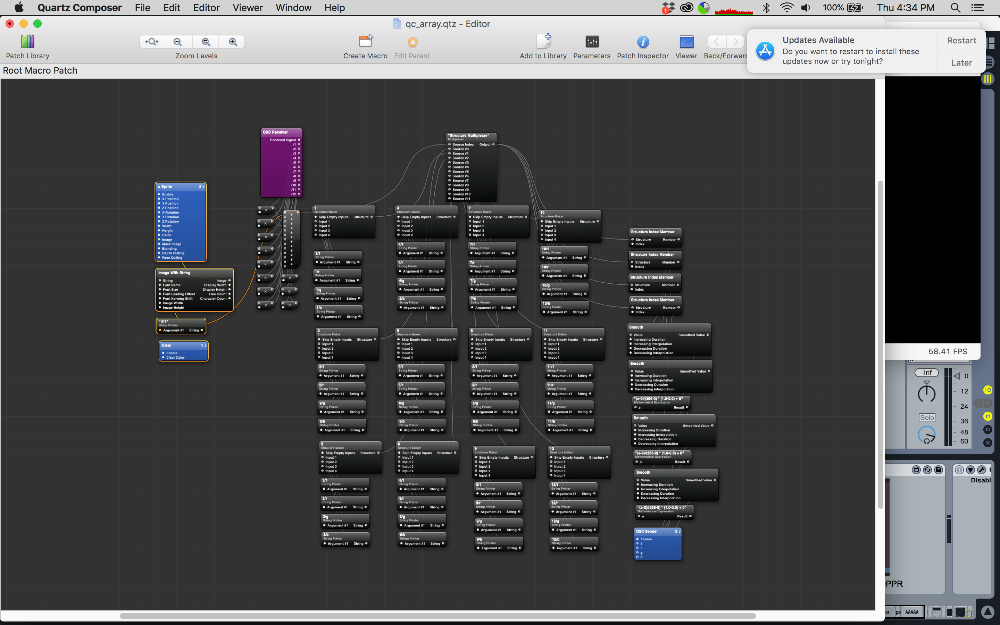

# body_language
interactive max/msp + quartz composer spaghetti monster

--

interactive touchable structure in the middle of the room was linked to a wifi arduino that was sending OSC data to my computer and then my computer did a bunch of math and turned that input / IR data into cool squiggly lines and spatial audio. 

--

